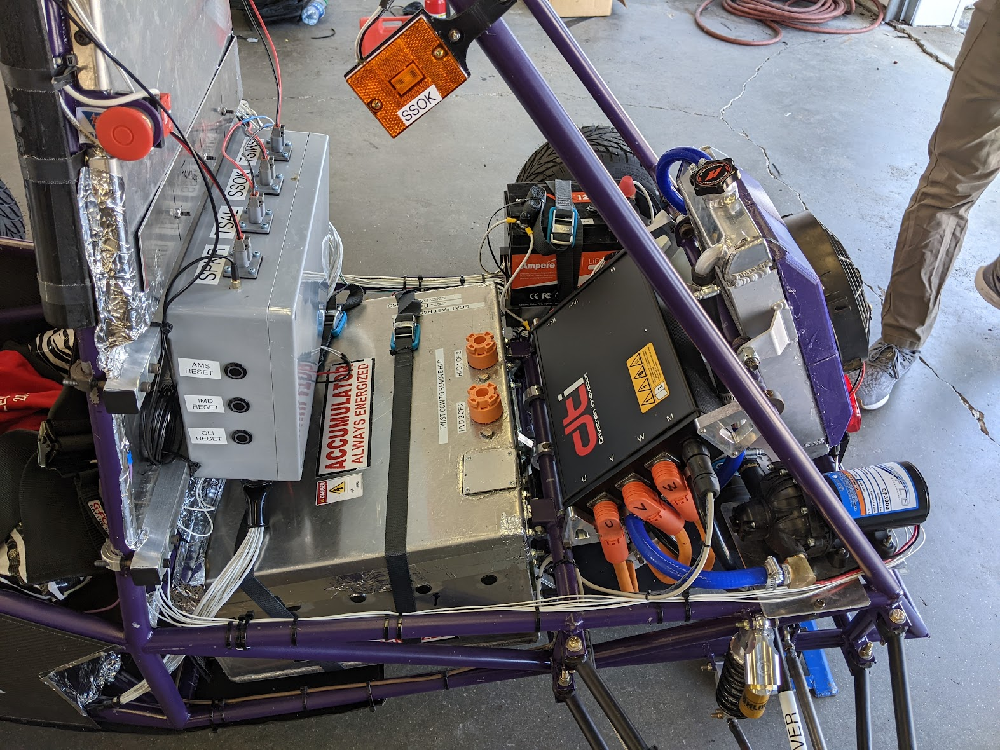
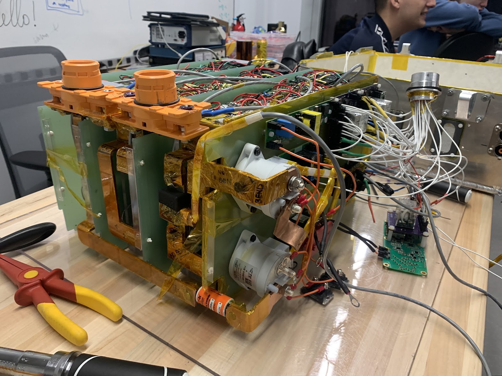
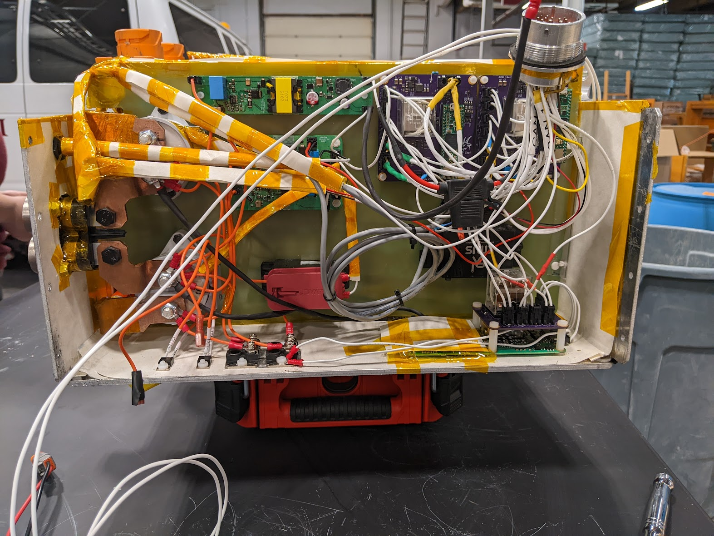
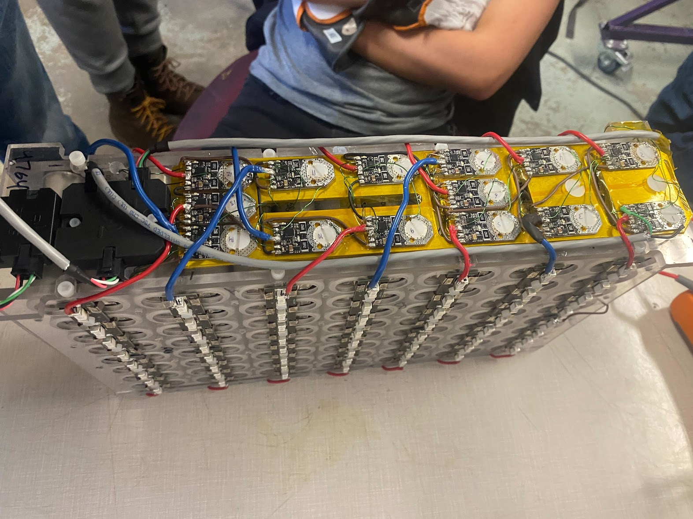
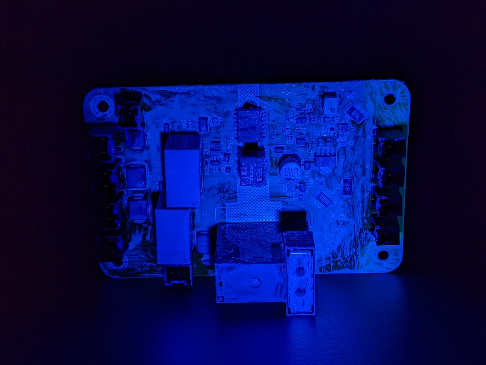

a nice picture of our ~~boat~~car with the IEEE Excellence in EV Engineering award

an absolute packaging nightmare in the rear end of the car

the accumulator assembled without its case during initial testing

our HV control box

one of the four segments that make up our accumulator

one of our pcbs (this image is under uv to demonstrate conformal coat)

