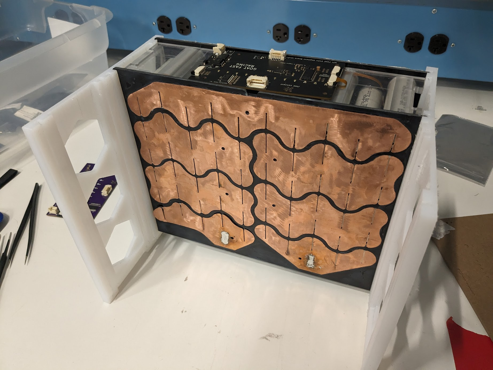
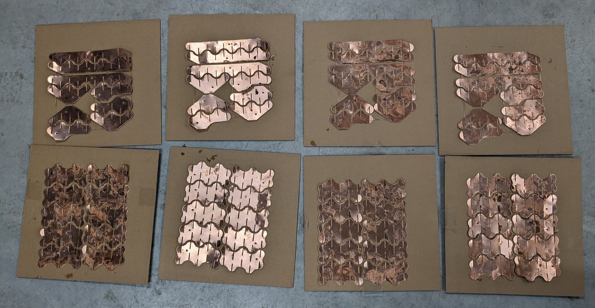
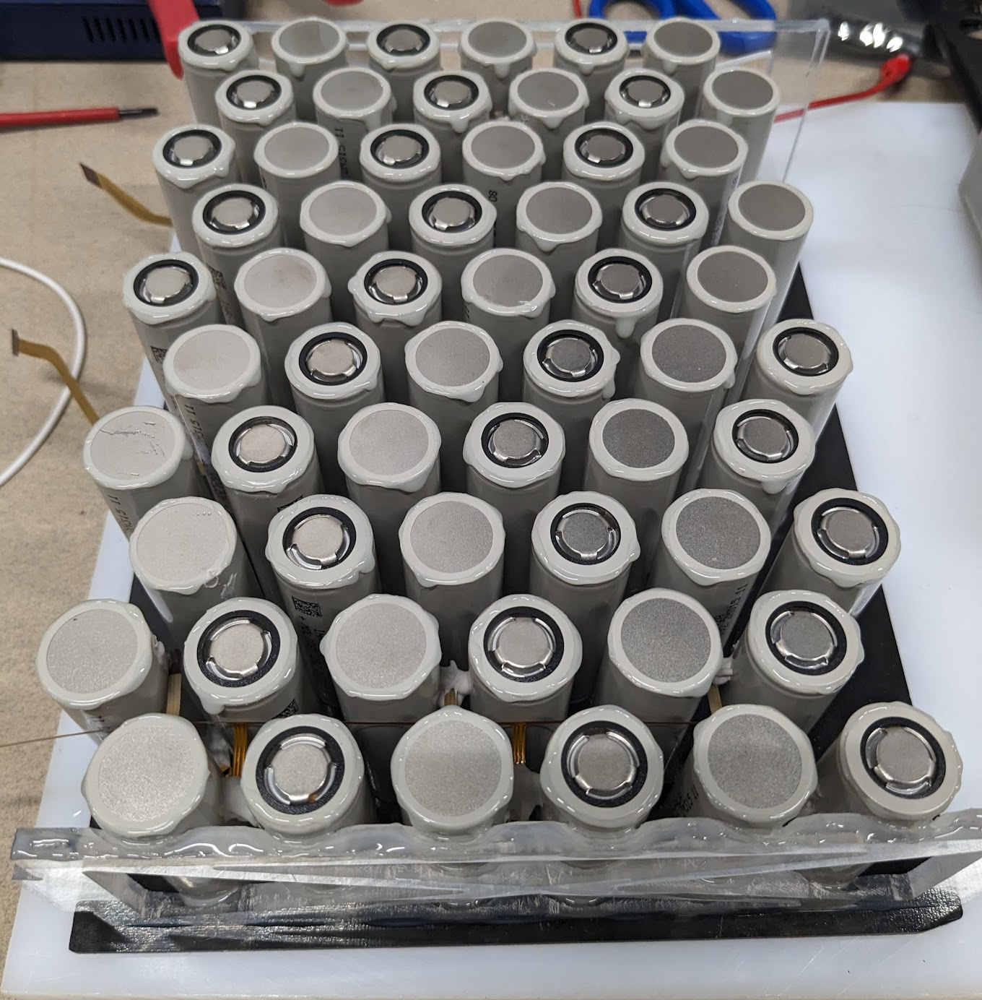
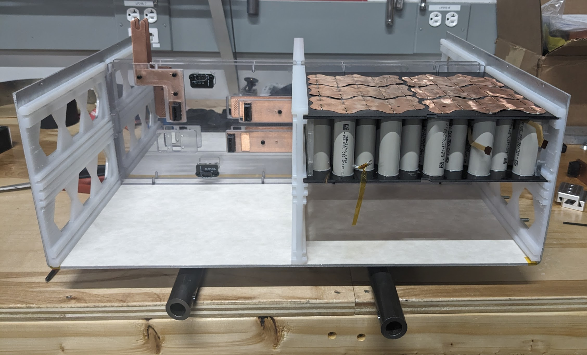
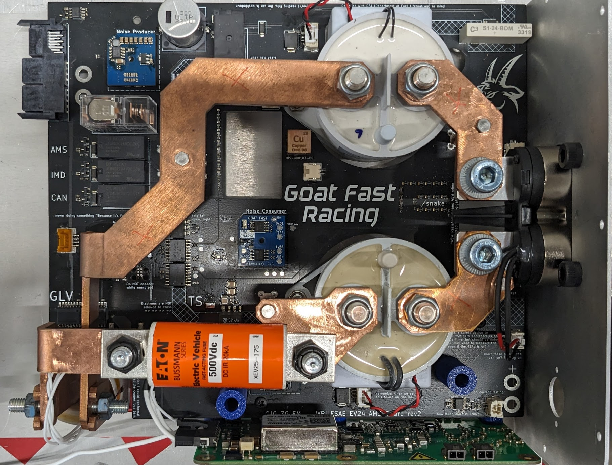
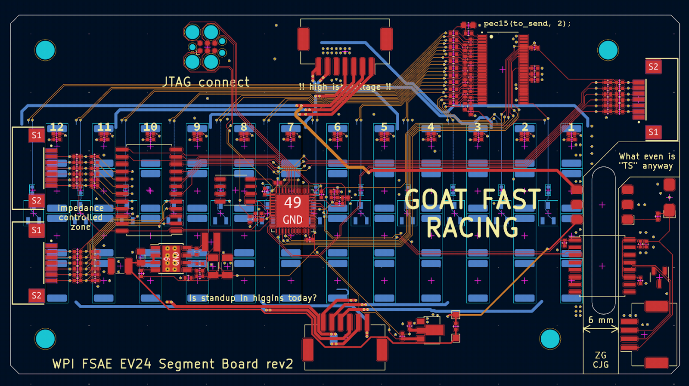
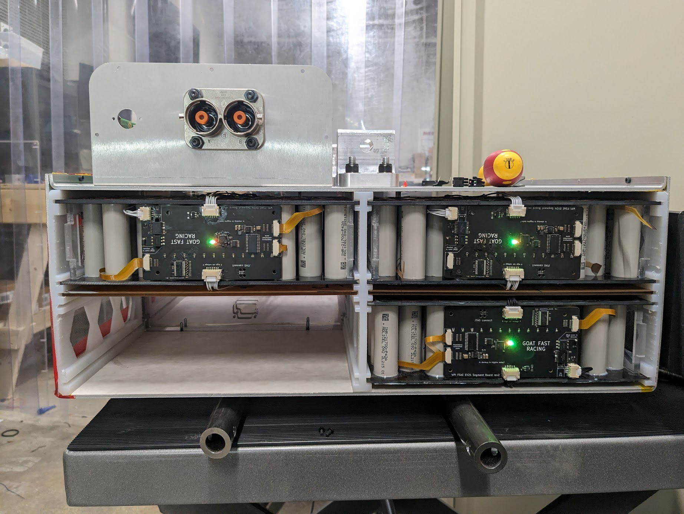
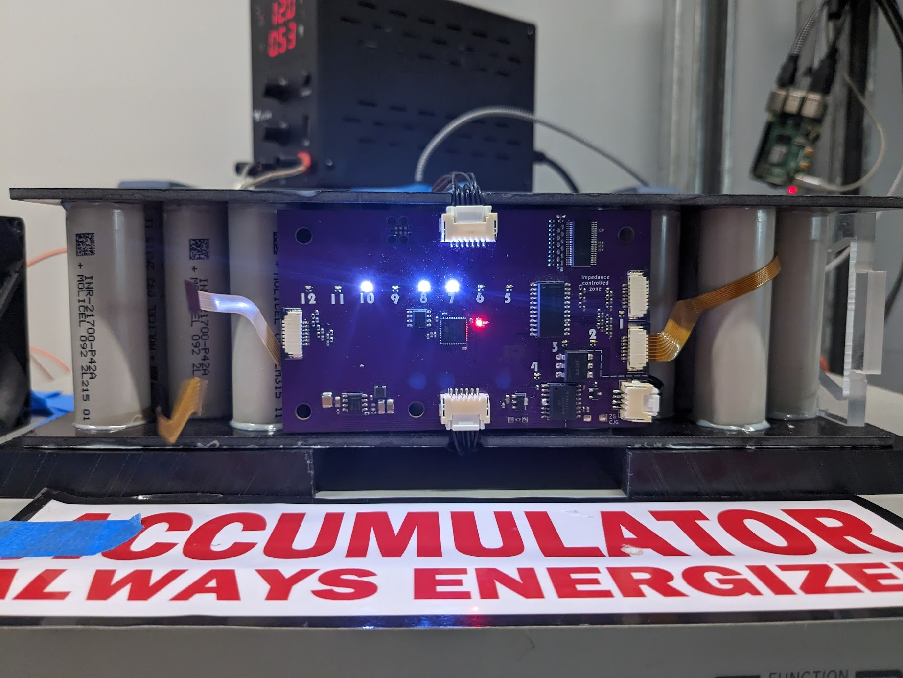

# FSAE Electric 2024

Going into the 2024 season, which would be many of our last, our team knew we wanted to attempt something at the edge of our abilities. We decided to build a full competition legal electric car in a single year, a feat which had previously taken three. In addition to this, we wanted the car to be highly reliable and extremely fun to drive. I was our electrical lead, which meant that I was ultimately responsible for everything from the design, manufacturing, and integration of our high voltage battery to the firmware that runs on our custom STM32 based sensor/data acquisition PCBs.

## HV Battery

To maximize performance while fitting in our existing design constraints, we designed our pack around a 5P96S topology with Molicel INR21700-P42A cylindrical Li-Ion cells. The ~7.4 kWh pack is split into 8 5P12S modules. The 60 cells in each module are arranged in a honeycomb pattern for optimal packing density and airflow. While this arrangement is great for density, it leads to some difficulty making the busbar connections between cells. We eventually settled on the "structural PCB" approach that can be seen below. Unfortunately, we were not able to take advantage of commercial PCB fabrication because we needed ~10oz copper and the spots where cells contact the copper require copper but no FR4. No fab in their right mind would make this board for any reasonable amount of money. Frankly, we should have taken this as the very strong hint that it is. Our first attempted manufacturing technique was milling the FR4, laminating copper foil to it, then milling the copper. We were fairly successful with the FR4 milling, but the copper was another beast entirely. We developed a "bed leveling" system for our CNC router to correct for warp in the laminate, but still had constant issues with either going halfway through the copper or sinking the endmill into the FR4, which basically destroys it. After some time, a faculty member approached us asking if we wanted to use a waterjet cutter in one of the research labs. Our answer was of course yes, and so we traded our finicky CNC router for an even more finicky waterjet cutter (it liked to backfire high pressure water through the abrasive feed system, which would basically scrap a whole hopper of garnet media). Despite the issues, this made the manufacturing leagues better, and we were able to manufacture our battery modules after all.

*A completed (except for spot welding) module in a frame*

*Copper "pours" fresh from waterjet cutting*

After epoxying the copper pours to the FR4 sheets, we epoxied the cells into the sheets. We used thermally conductive epoxy to attach flex PCBs with SMD thermistors to some cells.

*A module with epoxy on the cells waiting for the top plate to be installed*

*One module on its rails in our pack*

*The main high voltage control and monitoring box*

*BMS module board layout*

